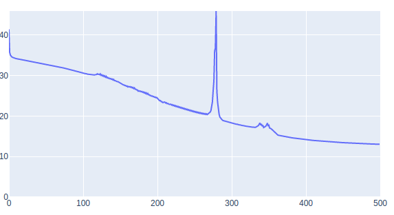

# MiniTorch Module 1


* Docs: https://minitorch.github.io/
* Overview: https://minitorch.github.io/module1.html

Results of optimization on Datasets
### Simple
```
PTS = 50
HIDDEN = 2
RATE = 0.5
data = minitorch.datasets["Simple"](PTS)
Epoch  500  loss  0.700677858267683 correct 50
```

###Split
```
PTS = 50
HIDDEN = 10
RATE = 0.5
data = minitorch.datasets["Split"](PTS)
Epoch  500  loss  3.4009029420130488 correct 49
```

### Xor
```
PTS = 50
HIDDEN = 10
RATE = 0.5
data = minitorch.datasets["Xor"](PTS)
Epoch  500  loss  14.184495586232694 correct 45
```

## Diag
```
PTS = 50
HIDDEN = 4
RATE = 0.5
data = minitorch.datasets["Diag"](PTS)
Epoch  500  loss  1.9800 correct 50
```

